# AI Investment Research Agent

## Overview

Give it a public company name or ticker and it streams back a research report: live financials and technicals from Yahoo Finance, an AI-synthesized read on news sentiment and competitive position, and a deterministic INVEST/PASS verdict with a supporting memo. It uses real financial data from Yahoo Finance, deterministic scoring, and AI-powered synthesis — not six LLM calls asking GPT to guess numbers. The pipeline makes exactly two LLM calls per run, both constrained to a Zod schema, and every non-LLM step is a pure, reproducible function you could unit test without a network connection.

## Demo


*(Add a screenshot or a short screen recording of a real run here — e.g. searching "NVIDIA" through to a completed report. A GIF showing the pipeline timeline animate through its four steps sells the architecture better than any paragraph of this README.)*

## Architecture

```mermaid
flowchart LR
    subgraph Node1["1 · fetchData (no LLM)"]
        direction TB
        Y1[Yahoo · profile]
        Y2[Yahoo · financials]
        Y3[Yahoo · price history]
        Y4[NewsAPI · articles]
        Y5[technicalindicators · SMA/RSI/MACD]
    end

    Node1 -->|profile, financials,<br/>candles, news, technicals| Node2["2 · synthesize (LLM #1)"]
    Node2 -->|sentiment, competitive<br/>position, risk factors| Node3["3 · score (no LLM)"]
    Node3 -->|decision, confidence,<br/>score breakdown| Node4["4 · narrate (LLM #2)"]
    Node4 -->|bull/bear case, memo,<br/>entry/target/stop| Out[ResearchReport]

    style Node1 fill:#0d1117,stroke:#3fb950,color:#e6edf3
    style Node2 fill:#0d1117,stroke:#d29922,color:#e6edf3
    style Node3 fill:#0d1117,stroke:#3fb950,color:#e6edf3
    style Node4 fill:#0d1117,stroke:#d29922,color:#e6edf3
```



Node 1 fires all five data sources in parallel via `Promise.allSettled` — one provider going down doesn't take out the others, and each success/failure is tracked as a named data source (`yahoo-profile`, `yahoo-financials`, `yahoo-history`, `newsapi`, `technicalindicators`) so the UI can show "3/5 data sources" instead of silently returning a degraded report. Deliberate separation: **math in code, reasoning in LLM.** Node 3's scoring is a pure weighted-sum function over the fetched financials and Node 2's synthesis — same inputs always produce the same decision and confidence. The LLM in Node 4 is handed that decision as a fixed fact and only explains *why*; its schema has no field that could override it.

Progress streams to the browser as NDJSON — one `{step, status, ...}` line per pipeline event — so the frontend can show a live timeline instead of a blank spinner for the ~15-30s a full run takes.

## Key Design Decisions

**Two LLM calls, not six.** Everything that's arithmetic — P/E scoring, growth normalization, the weighted verdict — is deterministic code (`lib/scoring.ts`). The LLM is only asked for things that genuinely require language understanding: reading news articles for sentiment, and writing prose around an already-computed number. Fewer calls means lower latency, lower cost, and a decision that doesn't drift between runs on identical data.

**Deterministic scoring engine.** Six weighted dimensions (growth 25%, valuation 20%, leverage 15%, sentiment 10%, risk 20%, competition 10%) combine into a 0-100 score; ≥60 is INVEST. Every dimension function is pure and independently testable — `scoreGrowth(financials)` doesn't know an LLM exists. This is what makes "same data → same score" true, and it's what a backtester (see below) could actually validate against historical returns.

**Real data sources, not memorized facts.** Yahoo Finance is queried live for profile, financials, and one year of daily candles; NewsAPI supplies actual recent articles. The synthesis prompt is explicitly told not to recall facts from memory — only to interpret the data handed to it — because an LLM asked to "tell me about Company X" will happily hallucinate a plausible-sounding but wrong P/E ratio.

**Zod validation on all LLM output.** Both LLM calls go through `withStructuredOutput()` against a Zod schema (`lib/schemas.ts`), so a malformed or off-spec response fails validation rather than silently corrupting the report — `structuredCall()` retries on that failure the same as a 5xx.

**NDJSON streaming.** The route calls the four pipeline nodes directly rather than invoking a compiled LangGraph, specifically so it can emit a `running` chunk the instant a step starts, not just after it finishes — that's what lets the timeline UI show a live spinner instead of jumping straight to "done."

**Graceful degradation, end to end:**
- Ticker resolution failure (fake/unknown company) → hard stop before any LLM call, exact error surfaced (`Could not find ticker for X...`) — the pipeline never proceeds to synthesize on data that doesn't exist.
- Any of the 5 data fetches failing → `Promise.allSettled` isolates it; the report renders with a documented gap instead of failing the whole request.
- Missing `NEWSAPI_KEY` → news step returns `[]`, sentiment defaults to neutral, nothing throws.
- LLM call failing → 2 retries with exponential backoff on retryable errors (429/500/502/503), then falls back to neutral synthesis defaults (score) or an unembellished verdict with empty prose (narrate) — the run still completes.

## How to Run

```bash
git clone https://github.com/mavishsiraj/AI_Investment_app.git
cd AI_Investment_app/frontend
npm install
cp .env.example .env.local
# edit .env.local — set GROQ_API_KEY (required) and NEWSAPI_KEY (optional)
npm run dev
```

Open `http://localhost:3000`. The Next.js app is self-contained — its own `/api/research` route runs the full pipeline, so no separate server is required for local dev.

> There's also a standalone Express server in `backend/` running the identical pipeline on port 4000. It exists for running the research pipeline outside of Next.js (e.g. a CLI or a non-Vercel host); it is **not** used by the deployed frontend and doesn't need to be started for the app above to work.

Required env vars (see `frontend/.env.example`):

| Variable | Required | Purpose |
|---|---|---|
| `GROQ_API_KEY` | Yes | LLM calls (Groq's OpenAI-compatible endpoint) |
| `GROQ_MODEL` | No | Defaults to `llama-3.1-8b-instant` |
| `NEWSAPI_KEY` | No | Enables news + sentiment; omitted → neutral sentiment, no crash |

## Deploying to Vercel

1. **`vercel.json`** lives in `frontend/` (not the repo root) and sets the research route's max duration:
   ```json
   { "functions": { "src/app/api/research/route.ts": { "maxDuration": 120 } } }
   ```
   120s comfortably fits Vercel's current Hobby-tier limit (300s with Fluid Compute) as well as Pro, so this works on the free tier.
2. Push to GitHub.
3. In Vercel, **Add New → Project**, import this repo, and set **Root Directory to `frontend`** — this is the part that's easy to miss, since the actual Next.js app isn't at the repo root.
4. Add environment variables in the Vercel project settings: `GROQ_API_KEY` (required), `GROQ_MODEL` (optional), `NEWSAPI_KEY` (optional).
5. Deploy. The frontend calls its own `/api/research` route on the same origin — no `NEXT_PUBLIC_BACKEND_URL` needed in production.

## What I'd Improve

- **RAG over SEC filings** — pull 10-K "Risk Factors" sections for the risk-synthesis step instead of relying solely on news coverage, which skews toward recent sentiment over structural risk.
- **Backtest the scoring engine** — the weights (growth 25%, valuation 20%, etc.) are reasonable priors, not fitted; running them against historical financials + forward returns would validate or recalibrate them with actual evidence.
- **Cache with stale-while-revalidate** — Yahoo/NewsAPI data doesn't change minute to minute; caching by symbol would cut latency and API usage for repeated searches without sacrificing freshness.
- **Multi-company comparison mode** — run the pipeline for 2-3 tickers in parallel and render score breakdowns side by side; the scoring engine already returns a comparable structure, this is mostly a frontend layout problem.
- **WebSocket instead of NDJSON** — fine for one-way progress updates today, but a WebSocket would allow cancelling a specific in-flight step or steering the run (e.g. "skip news, just give me the financials") without a new HTTP request.
- **Collapse the duplicated pipeline code** — `frontend/src` and `backend/src` currently contain near-identical copies of the agent nodes and services. Worth extracting into a shared package before it drifts.
- **Move rate limiting off in-memory state** — the current per-IP limiter is a `Map` in the route module, which resets on redeploy and isn't shared across serverless instances; fine for a demo, not for anything with real traffic (Upstash/Redis would fix this).

## Tech Stack

| Choice | Why |
|---|---|
| **Next.js 14 (App Router)** | One project for UI + the streaming `/api/research` route — no separate backend to deploy for the common case. |
| **TypeScript (strict, `noUncheckedIndexedAccess`)** | Caught real bugs during development (array-index-as-`undefined` cases in the technicals math) that loose TS would have let through silently. |
| **LangChain (`@langchain/openai`) + Groq** | `withStructuredOutput()` gives schema-enforced LLM output for free; Groq's OpenAI-compatible endpoint serving Llama 3.1 8B keeps per-call latency low enough for a synchronous research pipeline. |
| **Zod** | Single source of truth for LLM output shape — the schema *is* the contract, not a type someone forgot to update after changing a prompt. |
| **yahoo-finance2** | Free, no API key, covers profile/financials/history in one library instead of stitching together several paid data vendors for a demo project. |
| **NewsAPI** | Simple REST API for recent article search; treated as optional/best-effort since it's the one external dependency without a generous free tier. |
| **technicalindicators** | Battle-tested SMA/RSI/MACD implementations instead of hand-rolling indicator math. |
| **lightweight-charts** | TradingView's charting library — real candlestick rendering with a much smaller bundle than most React chart libraries. |
| **recharts** | Used only for the radar chart; good enough there and avoids pulling in a second heavy charting dependency for one visualization. |
| **Tailwind CSS** | Fast to hit specific responsive breakpoints (2-col → 4-col grids, stacking on mobile) without hand-writing media queries. |
| **Zod-validated NDJSON over fetch streams** | No new infrastructure (no WebSocket server) while still giving the frontend real-time step-by-step progress. |
